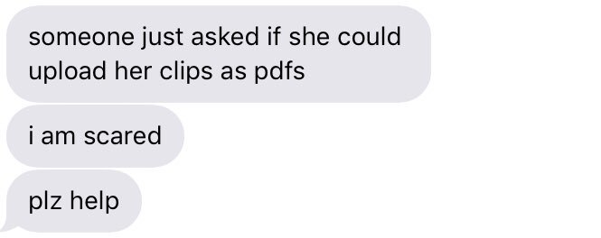
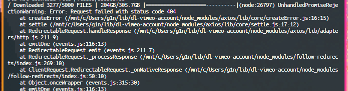
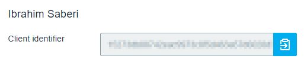
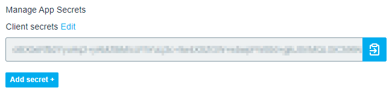
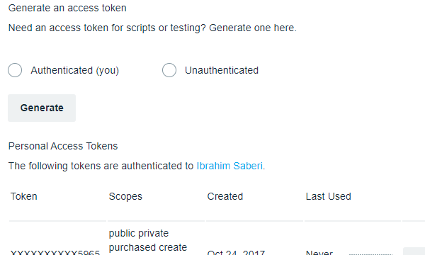

# dl-vimeo-account
## A node script that downloads all video files (highest transcoded quality) from your vimeo account

Targets Vimeo API version 3.2

### Who would ever need this?

Anyone with a Vimeo business account with >20 videos who needs to download all of those videos for whatever reason. That reason definitely would never have anything to do with migrating away from Vimeo. Nobody would *ever* do that.

### What you'll need:

* A Vimeo business/ pro account (to access file download links from the developer api)
* A Vimeo API App set up on the [Vimeo developer portal](https://developer.vimeo.com/apps)
* That Vimeo API App's [Client ID](#client-id)
* Vimeo API App [Client Secret](#client-secret)
* Vimeo API App [Personal Access Token with the `video_files` scope](#personal-access-token)

__NOTE: If you don't have a Vimeo business account I don't believe you can use this. Vimeo only gives download link accessibility via the Vimeo API to Business/PRO accounts as far as I know.__ (please let me know if this isn't true, or if there's a way around this limitation)

#### How to use:

* Clone this, download this, or (__if you're a heathen__) open up your favorite text editor and rewrite/ copy each file over to the same directory
* Do _not_ look too closely at `index.js`. It's Really Not Good Programming and half the time I spent making this went into making that gif in the readme look _real nice_.
  * Also I'm baby
    * Feel free to tell me I'm terrible but please tell me why
* Run `npm install`
  * If you don't know what that means [check this out](https://www.npmjs.com/get-npm)
* Run `node index.js` or `npm start` (what? you want to install this on your path? let me know and I'll make this less terrible to use)
* You'll be asked for your app's access token, client id, and client secret in the command line. Input them. If you don't specify this the utility can't fetch the file data from the Vimeo API.
* You'll be asked for a filepath to save the videos and log output. If you don't specify an absolute file path (i.e. with a leading `/`) the path will resolve relative to the directory that `index.js` is located in. I think. I haven't actually tested this out.
  * If you don't specify a filepath, your videos will be saved in the directory where `index.js` is located under the subdirectory `videos`.

If you use the Vimeo API to upload, you might have some videos that are corrupted (and you haven't deleted them yet because you have better things to do than navigate to vimeo.com). Corruption can happen either during the transcoding process or in the upload process or perhaps when __someone tries to upload a fucking PDF as a video__.

In those cases Vimeo will still recognize that the video exists but there will be no video files or they'll come in as some unrecognizable and unusable format. For any video where this happens to be the case it'll log that to the command line and then also to a `LOG` file which is placed wherever you specified where your videos should be downloaded to.

### What EXACTLY is being downloaded?

Each Vimeo video has a uri; that uri serves as the filename plus whatever extension is in use for that video. The script will attempt to take the highest quality (aka largest width) Vimeo transcoded video. That means it will not download the actual source file that you originally uploaded (this is a totally separate thing!). 

Also, it's unclear whether QHD (aka 2K or 1440P) or UHD (4K or 2160P) videos are detected properly but I'm guessing that the script will download the 1080P versions of those. Will fix in the future.

### What? Why wouldn't you download the source video when possible?

Because I made this for _me_ and I already have all of my source videos.

In reality I didn't want to deal with the edge case of source files being corrupted or missing, and all of my source files were at most 1080P, so the Vimeo transcoded versions always worked for me.

### Huh? Why would you need this if you already have all of your source videos?

I needed the transcoded versions that are on Vimeo as well because of reasons.

### This script is terrible. It {crashed, didn't work, stopped working in the middle of the download process}!

I know! It sucks! Especially that third situation if you have, say, __Literally Five Thousand Videos To Download__.

In the former 2 cases, create an issue with whatever output node spits out and I'll look into it. In the latter case, still create an issue to let me know what happened, but the script will also save all of your file data and keep note of how far you are in the process, so if you rerun the script you _should_ in theory be able to just resume the download process. Let me know if that isn't the case.

## What You'll Need (but with pictures!)

### Client ID

`Home > My Apps > {APP NAME} > (In Sidebar) General Information`

It's the first thing you see (marked __Client identifier__):

### Client Secret

`Home > My Apps > {APP NAME} > (In Sidebar) Authentication > Manage App Secrets`

Marked __Client secrets__ (if you have multiple you should be able to use any of them):

### Personal Access Token

`Home > My Apps > {APP NAME} > (In Sidebar) Authentication > Personal Access Tokens`

If you don't currently have a personal access token with the `video_files` scope, you'll need to create one:

It should go without saying but I've deleted that token. __Don't try to use it el oh el__